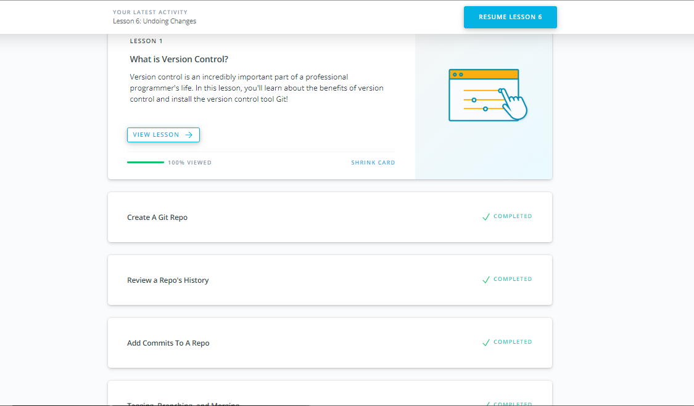
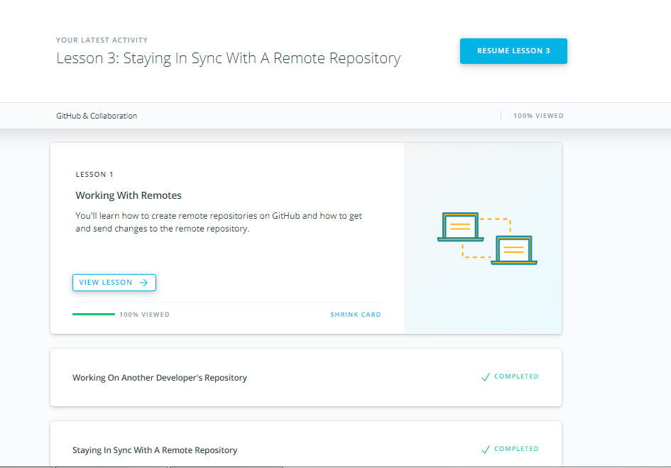

# Git for Team Collaboration

### After Udacitys course I:

- Understand the git and most popular operations with it
- Improve skills to work with local and remote repo
- Get knowledge about fork and pull requests

## What is Version Control

## GitHub & Collaboration

